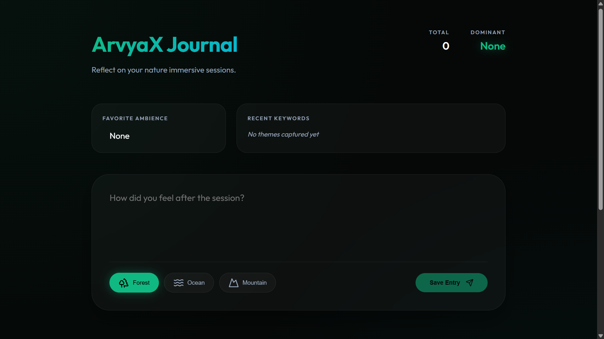
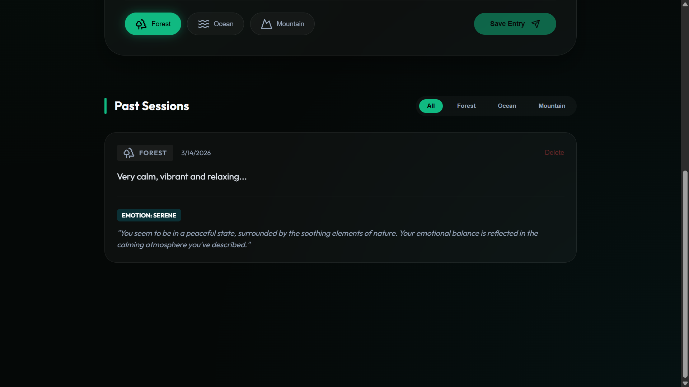

# 🌿 ArvyaX Journal: Immersive Nature Reflection

ArvyaX Journal is a high-fidelity, full-stack journaling system designed for users to reflect on their immersive nature sessions (Forest, Ocean, Mountain). Powered by AI, the system provides emotional insights, keyword extraction, and a premium, nature-themed dashboard.



## 🌐 Live Demo
[View Live Application](https://arvyax-full-stack-assignment.vercel.app/)

## ✨ Core Features

- **🌲 Nature Sessions**: Specialized entry modes for Forest, Ocean, and Mountain ambiences.
- **🤖 AI Emotion Analysis**: Deep emotional reflection powered by Groq (Llama 3.3 70B).
- **📊 Real-time Insights**: Dynamic dashboard tracking total entries, dominant emotions, and trending keywords.
- **🎨 Premium UI**: A high-fidelity "Forest Noir" aesthetic with glassmorphism and fluid animations.
- **🔍 Advanced Filtering**: Filter your journey by nature theme to identify trends in your mental state.
- **🗑️ Full CRUD**: Complete control over your journal entries with secure deletion.

## 🚀 Technical Stack

- **Frontend**: Next.js 15 (App Router), Framer Motion, Lucide Icons.
- **Backend**: Next.js API Routes (Edge-ready).
- **Database**: Prisma ORM with PostgreSQL (Vercel Postgres).
- **AI**: Groq SDK (Ultra-low latency Llama 3 analysis).
- **Styling**: High-fidelity custom CSS with the **Outfit** typeface.

## 📸 Screenshots

### AI Insight & Analysis
The system identifies deep emotional patterns and provides empathetic summaries based on your reflections.



## 🛠️ Getting Started

1. **Install Dependencies**:
   ```bash
   npm install
   ```

2. **Environment Variables**:
   Create a `.env` file and add your credentials:
   ```env
   PRISMA_DATABASE_URL="your_prisma_url"
   POSTGRES_URL="your_postgres_url"
   GROQ_API_KEY="your_api_key_here"
   ```

3. **Initialize Database**:
   ```bash
   npx prisma db push
   ```

4. **Run Development Server**:
   ```bash
   npm run dev
   ```
   Open [http://localhost:3000](http://localhost:3000) to view the app.

## 📐 Architecture

For a deep dive into how this system scales to 100,000+ users, handles security, and optimizes AI costs, see [ARCHITECTURE.md](./ARCHITECTURE.md).

---
_Built with ❤️ for the ArvyaX Nature Immersive Experience._
